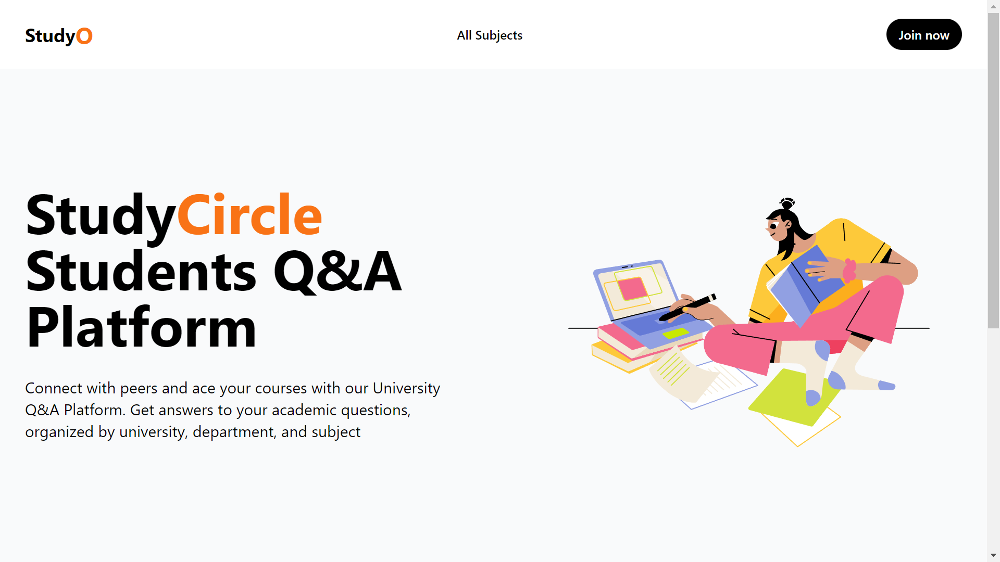

# StudyCircle, University Q&A Platform by Team परिवर्तन

## Table of Contents

- [Introduction](#introduction)
- [Problems](#problems)
- [Solution](#solution)
- [Features](#features)
- [Tech Stack](#tech-stack)
- [How to run the program](#how-to-run-the-program)
- [Screenshots](#screenshots)
- [Team Members](#team-members)
- [Contributors](#contributors)

## Documents

- [Idea Pitching Slides](https://docs.google.com/presentation/d/1nj_9vac3rPZuHqBhDnBvg64sOldZKKCzF6NkLasqXC8/edit?usp=sharing)
- [Final Slides](https://docs.google.com/presentation/d/1xNHHcb-6Wc0VHbky9GhkR6Bx_F16HWKR0dr-DN23Tis/edit?usp=sharing)

## Introduction

StudyCircle Student focused Platform dedicated to bring all learners together at one place to support each other and excel at their studies with the use of best recommended resources.

## Problems

1. No Common platform for students to ask questions
2. Lack of Communities which provides relevant resources and help/guide to students for their personal and professional growth
3. No proper archiving or storage of discussions and resources
4. No Medium which connects students of multiple Universities and Colleges
5. Lack of Resources in time for students to study like in Karnali ZOne as the penetration of Internet is increasing

## Solution:

Study Circle comes with the solutions of all the above problems:

1. Common platform where all students come together to ask questions
2. Platform where Experts and talented group of people are answering the questions
3. Bots automatically generates the best solutions of the problems asked
4. Place where all the discussions are stored like in Stack Overflow on the basis of relevancy
5. Curated Resources recommended according to questions asked
6. Place where the learning is made easier and accessible to everyone with the use of technology

## Features:

1. User Registration: Students can register on the platform to ask and answer questions. They will be required to provide their name, email address, university, department, and subjects.
2. Ask Questions: Once registered, students can ask questions related to their university courses by selecting the appropriate department and subject.
3. Get Auto-generated Answers from our bot
4. Get Recommendations of the resources according to questions
5. Search: Students can search for questions and resources by university, department, subject, or keyword.
6. Admin Dashboard: An admin dashboard will be available for platform administrators to manage user accounts, questions, and answers. Administrators can review reported content, remove inappropriate content, and block users who violate community guidelines.
7. Spam Filtering by ML model
8. UpVote and DownVote in answers and questions

## Tech Stack

Front-end: NextJS,TypeScript, TailwindCSS
Backend:Python, Socket, Pocketbase

## How to run the program

1. `cd pocketbase` `./pocketbase serve` starts the pocketbase server
2. Login id for pocketbase: admin@admin.com Password: adminpassword, you'll get all the data we have stored and the database design
3. Navigate to src\utils\pb.ts and change the url to your local pocketbase server url
4. `yarn dev` to start development server

## Screenshots

## Team Members

Rupesh Budhathoki (Frontend and Database Design)
Rikesh Silwal (AI/ML)
Kushal Bastakoti (Backend and Database Design)
Bibek Dhakal (Project Manager)

# Contributors

If you want to help to make this project happen feel free to create a issue and let's work on it together ;)
